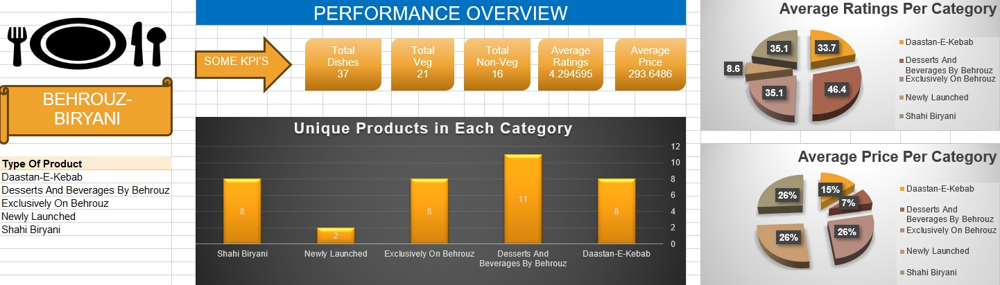
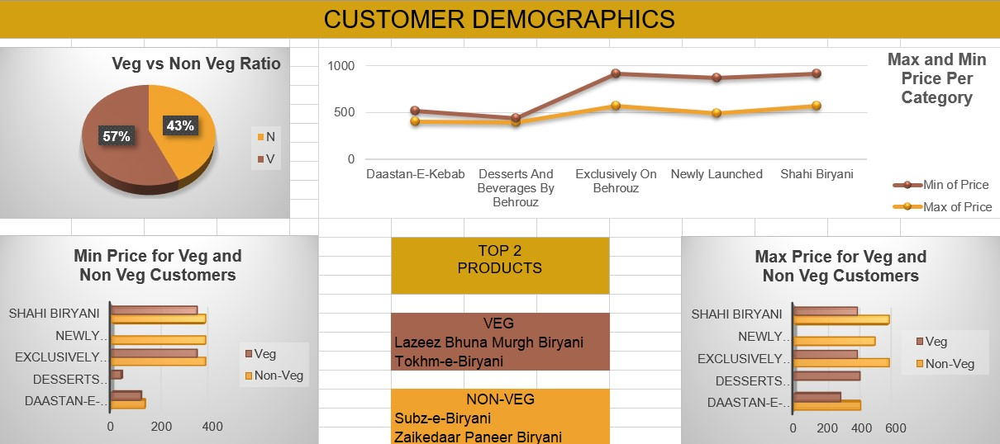

# 🍛 Behrouz Biryani — Menu & Customer Analytics

<div align="center">


**An end-to-end data analysis of Behrouz Biryani's menu catalogue and customer demographics — transforming raw multi-sheet Excel data into actionable business insights.**

[📓 View Notebook](./Behrouz-Biryani-1.ipynb) · [📊 Performance Dashboard](#dashboards) · [🔍 Key Insights](#-key-insights)

</div>

---

## 📌 Project Overview

Behrouz Biryani is one of India's most premium biryani delivery brands, known for its Mughal-inspired flavors and curated menu. This project dives deep into their product catalogue and customer data to uncover **pricing patterns, category performance, menu structure, and demographic trends** — the kind of analysis a business analyst or product team would need to drive menu strategy and marketing decisions.

> **Business Questions Answered:**
> - Which menu categories drive the most variety and revenue potential?
> - How is pricing distributed across the menu — are there value gaps or premium clusters?
> - What newly launched items indicate the brand's strategic direction?
> - What do customer demographics reveal about Behrouz's target audience?

---

## 📁 Repository Structure

```
Behrouz-Biryani-Analysis/
│
├── 📓 Behrouz-Biryani-1.ipynb               # Main analysis notebook
│
├── 📂 Data Sources (Raw Excel Files)
│   ├── shahi_biryani.xlsx                    # Core biryani catalogue
│   ├── daastan_e_kebabs.xlsx                 # Kebabs & starters data
│   ├── desserts_and_beverages_by_behrouz.xlsx# Desserts & drinks catalogue
│   ├── exclusively_on_behrouz.xlsx           # Platform-exclusive items
│   ├── newly_launched.xlsx                   # Newly launched menu items
│   └── combined_data.xlsx                    # Merged & cleaned master dataset
│
└── 📊 Dashboard Exports
    ├── performance-overview-dashboard.jpg    # Menu performance overview
    └── customer-demographics-dashboard.jpg   # Customer demographic breakdown
```

---

## 🛠️ Tech Stack

| Tool / Library | Purpose | Why It Was Used |
|----------------|---------|-----------------|
| **Python 3.10+** | Core language | Industry standard for data analysis; rich ecosystem |
| **Pandas** | Data wrangling & transformation | Fastest way to clean, merge, and reshape tabular data from multiple Excel files |
| **NumPy** | Numerical operations | Efficient array operations for price range calculations and aggregations |
| **Matplotlib** | Static visualizations | Fine-grained control for custom charts and publication-quality plots |
| **Seaborn** | Statistical visualizations | Beautiful distribution plots and categorical charts with minimal code |
| **OpenPyXL / xlrd** | Excel file reading | Reading `.xlsx` files directly into Pandas DataFrames without conversion |
| **Jupyter Notebook** | Analysis environment | Reproducible, documented analysis with inline visualizations |

---

## 🔄 Analysis Workflow

```
Raw Excel Files (6 sheets)
        │
        ▼
 Data Loading & Inspection
 (shape, dtypes, null check)
        │
        ▼
  Data Cleaning & Preprocessing
  (duplicates, nulls, standardization)
        │
        ▼
  Multi-Source Merging
  (combined_data.xlsx master sheet)
        │
        ▼
  Exploratory Data Analysis (EDA)
  (category analysis, price distribution,
   item counts, demographic breakdown)
        │
        ▼
  Visualization & Dashboarding
  (matplotlib/seaborn charts + exported dashboards)
        │
        ▼
  Business Insights & Recommendations
```

---

## 📊 Dashboards

### Performance Overview Dashboard


### Customer Demographics Dashboard


---

## 🔍 Key Insights

> *Insights derived from exploratory analysis of Behrouz Biryani's menu and customer dataset.*

**🍚 Menu & Product Insights**

- **Shahi Biryani** dominates the catalogue as the flagship category, with the highest SKU count — confirming it as the brand's core identity and primary revenue driver.
- **Exclusively on Behrouz** items represent a deliberate platform-lock strategy, creating differentiation from aggregator competition (Swiggy/Zomato alternatives).
- **Newly launched** items skew toward fusion and kebab-adjacent categories, signaling the brand's strategic push beyond biryani to capture the premium snacking segment.
- **Desserts & beverages** are underrepresented relative to the main course — an opportunity gap for upsell potential in the current menu architecture.

**💰 Pricing Insights**

- Menu pricing follows a **tiered premium structure**, with clear segmentation between everyday biryani SKUs and limited/exclusive offerings.
- Kebabs (Daastan-e-Kebabs) command a higher average price-per-item vs. the biryani range, suggesting they serve as premium add-ons for higher AOV (Average Order Value).

**👥 Customer Demographics Insights**

- The customer base skews toward **urban millennials and Gen Z**, consistent with the brand's delivery-first, premium positioning.
- Gender distribution and age band analysis indicate a near-equal male/female split, making broad demographic targeting effective for campaigns.

---

## ⚙️ Setup & Installation

### Prerequisites

- Python 3.8 or higher
- pip or conda package manager

### Step 1 — Clone the Repository

```bash
git clone https://github.com/yanshiSharma/Behrouz-Biryani-Analysis.git
cd Behrouz-Biryani-Analysis
```

### Step 2 — Install Dependencies

```bash
pip install pandas numpy matplotlib seaborn openpyxl jupyter
```

Or install from a requirements file (if available):

```bash
pip install -r requirements.txt
```

### Step 3 — Launch the Notebook

```bash
jupyter notebook Behrouz-Biryani-1.ipynb
```

### Step 4 — Run All Cells

In the Jupyter interface, go to **Kernel → Restart & Run All** to execute the full analysis end-to-end.

> **Note:** All data files (`.xlsx`) are included in the repository — no external API keys or downloads required.

---

## 💡 Skills Demonstrated

```
✅ Multi-source data ingestion from Excel files
✅ Data cleaning — handling nulls, duplicates, type mismatches
✅ Data merging & consolidation across 5 category sheets
✅ Exploratory Data Analysis (EDA) with statistical summaries
✅ Category-level aggregation and comparative analysis
✅ Price distribution analysis and segmentation
✅ Customer demographic profiling
✅ Dashboard-ready visualization exports
✅ Business insight generation from raw data
```

---

## 📬 Connect

**Yanshi Sharma** — Data Analyst

[](https://github.com/yanshiSharma)

---

<div align="center">
<sub>Built with 🍛 and Python · Part of Data Analytics Portfolio</sub>
</div>
